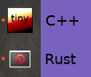

# gtk-icon-bug

This project illustrates a problem regarding desktop icon between a C++ and a Rust program that both use GTK.



After cloning the repository and installing dependencies, go to the gtk-icon-bug directory.
Install the C++ program and start the program
```
distrib/install cpp
tinygtk
```
The correct icon appears in the launch bar. Now install the Rust program and start it too:
```
distrib/install rust
tinygtk
```
The wrong icon appears in the launch bar.
